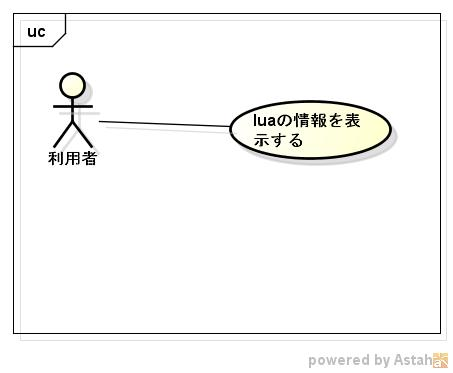

luatool
========
c言語からluaのライブラリを使用したツール集です。

## Description ##

詳細は、
https://siranovel.github.io/mydocs/luatool  

## Demo ##

## VS. ##

## Requirement ##
VineLinux ver 6.5に付属しているライブラリに依存

## Usage ##

## install ##
    git clone https://github.com/siranovel/luatool.git  
    cd luatool  
    rpm -ivh <rpmファイル名>  

## Contribution ##

## Licence ##

[MIT](LICENSE)

## Author ##

[siranovel](https://github.com/siranovel)
